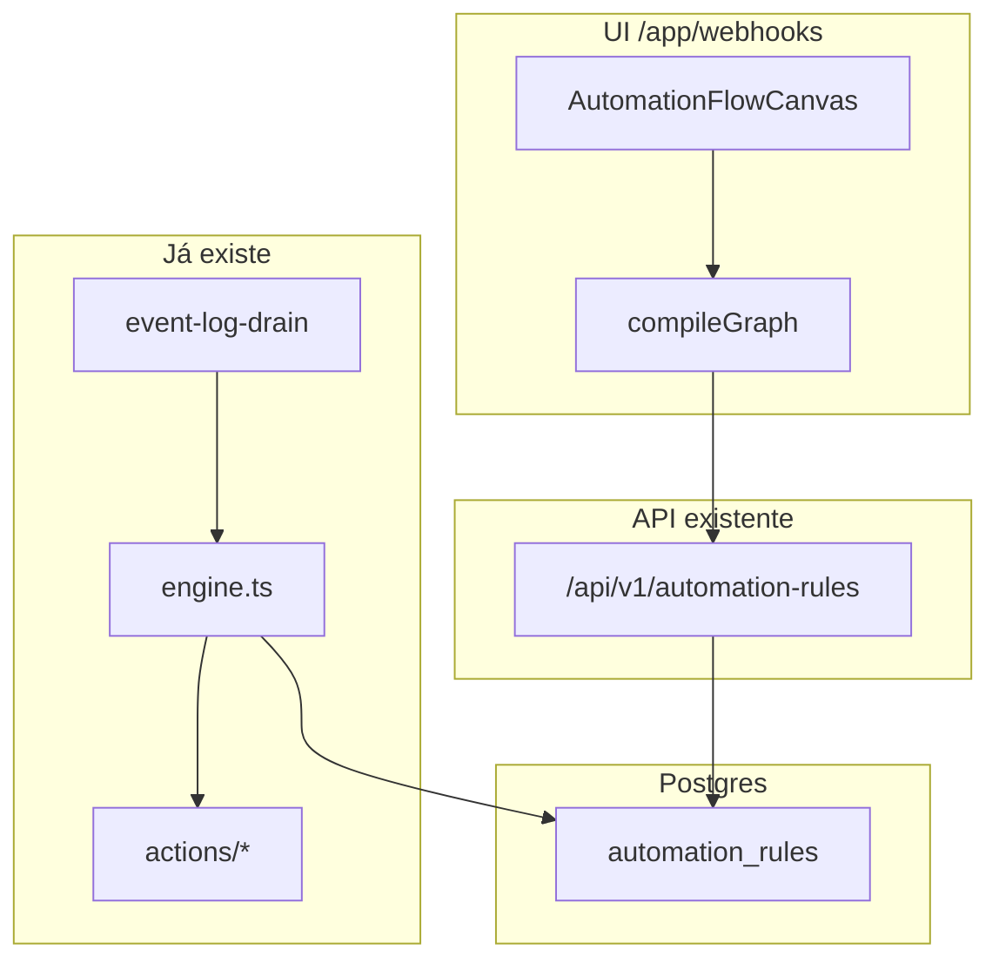

# CRM Automações — Fluxos visuais (Design)

**Spec:** `.specs/features/crm-automacao-fluxos/spec.md`
**Status:** Draft

---

## Architecture Overview

Dois produtos, dois relógios:

| | Automação CRM | Follow-up |
| --- | --- | --- |
| Relógio | Evento no `event_log` (drain) | `next_eval_at` + cron de enrollment |
| Persistência | `automation_rules` (+ `graph` em P2) | pointers/versions/enrollments |
| IA | Não | `followup_turn` |

O canvas de automação **reusa React Flow e o visual Sage** do builder de follow-up. **Não** reusa `followup_enrollments`, `node-handlers` de wait/classify, nem publish imutável de versão (regra de automação continua mutável com switch; não há lead “em voo” pinado numa versão).



P1: canvas → `compileGraph` → `trigger_event` + `conditions` + `actions` (colunas atuais). Motor **não abre**.

P2: coluna `graph jsonb` (rascunho = verdade quando ramificado). Motor ganha `walkGraph(graph, context)` no lugar do loop linear **somente** se `graph` tem ramificação; senão continua o loop atual (uma função, dois modos).

---

## Code Reuse Analysis

### Existing Components to Leverage

| Component | Location | How to Use |
| --- | --- | --- |
| Motor + contexto | `lib/automation/engine.ts` `buildContext` | Única hidratação de lead/contact/event |
| Condições | `lib/automation/conditions.ts` | Mesmo `evaluateConditions` nos nós |
| Ações | `lib/automation/actions/*` + `register-all.ts` | Nenhum executor novo |
| Zod regras | `lib/schemas/webhooks.ts` | P1: continua sendo o contrato de API; P2: grafo Zod à parte + compile |
| Editor linear | `RuleEditor.tsx` | Substituído pelo canvas; forms de ação reusam `ActionConfigForm` |
| Labels PT | `app/app/webhooks/_components/labels.ts` | Paleta e nós |
| React Flow mappers | `lib/followup/graph-mappers.ts` | **Padrão**, não o schema de nós do follow-up |
| Visual nós | `app/app/ai/followups/[id]/_components/nodes/` | Copiar tokens Sage (cores, handles), tipos novos em pasta de webhooks |
| CRUD + audit | `app/api/v1/automation-rules/` | Estender PATCH body; actions de audit já existem |
| E2E | `tests/e2e/webhooks.spec.ts` | Estender: abrir canvas em vez do sheet |
| Invariantes | `tests/invariants/automation-*.test.ts` | P2: caso ramo + fail-closed |

### Integration Points

| System | Integration Method |
| --- | --- |
| `event_log` drain | Inalterado |
| Throttle WhatsApp | `postponeUntil` no executor — evento inteiro, não nó |
| MCP operação | Tools de ligar/listar regra já existem; canvas é UI humana |
| Follow-up builder | Só CSS/tokens; zero import de `graph-schema` de follow-up |

### CONCERNS

Não há `.specs/codebase/CONCERNS.md`. Ponto frágil **CONFIRMADO** no próprio engine: duplicata `entity_kind` lead vs crm_lead — qualquer walk de grafo **reusa** o mesmo filtro, não reimplementa.

---

## Components

### `lib/automation/graph-schema.ts`

- **Purpose:** Zod do grafo de automação (nós `trigger` \| `condition` \| `action` \| `end`).
- **Location:** `lib/automation/graph-schema.ts` + `graph-schema.test.ts`
- **Interfaces:**
  - `AutomationGraph` — `{ nodes, edges }`
  - `validateAutomationGraph(graph): ValidationError[]` — 1 trigger, DAG, caminhos até `end`, tipos de ação ∈ registry
- **Dependencies:** Zod 4, lista de `type` dos executores
- **Reuses:** Ideia de `lib/followup` graph-schema; **schema próprio** (sem wait/ai)

### `lib/automation/compile-graph.ts`

- **Purpose:** P1: grafo linear ⇄ colunas v1. P2: detecta ramificação (`isLinear`).
- **Interfaces:**
  - `compileLinear(graph): { trigger_event, conditions, actions } | fail`
  - `decompileLinear(rule): AutomationGraph`
- **Reuses:** `TRIGGER_EVENTS`, `actionSchema`

### `lib/automation/walk-graph.ts` (P2)

- **Purpose:** Percorre o DAG no contexto do evento; chama `getAction().execute` na ordem do caminho.
- **Interfaces:** `walkGraph(ctx, graph): ActionResultDetail[]`
- **Dependencies:** `evaluateConditions`, `getAction`
- **Reuses:** mesmo `ActionCtx`

### `AutomationFlowCanvas`

- **Purpose:** Builder na aba Automações.
- **Location:** `app/app/webhooks/_components/flow/`
- **Reuses:** `@xyflow/react` (já no bundle do follow-up), `ActionConfigForm`, `TriggerConfig` via labels, dynamic import do canvas (mesmo cuidado de bundle do follow-up)

### API

- P1: body do POST/PATCH **inalterado** (colunas). Canvas compile no client **e** revalida no server (não confiar só no client).
- P2: `graph` opcional no PATCH. Se `graph` ramificado, colunas `conditions`/`actions` viram projeção linear do caminho “sempre” **ou** `[]` + motor lê `graph`. **Escolha:** motor lê `graph` quando `graph.nodes` tem `condition` com 2 saídas; senão lê colunas. Compile no save preenche os dois quando linear (compat listagens/MCP).

---

## Data Models

### P1 (sem migration)

Colunas atuais. Grafo só na memória da UI.

### P2

```sql
-- apêndice idempotente baseline + migration nova + MANIFEST
alter table public.automation_rules
  add column if not exists graph jsonb;
```

```typescript
type NodeType = "trigger" | "condition" | "action" | "end";

interface AutomationNode {
  id: string;
  type: NodeType;
  label: string;
  position: { x: number; y: number };
  config:
    | { event: typeof TRIGGER_EVENTS[number] } // trigger
    | { checks: RuleCondition[]; combinator: "and" } // condition
    | { type: ActionType; config: Record<string, unknown> } // action
    | Record<string, never>; // end
}

interface AutomationEdge {
  id: string;
  source: string;
  target: string;
  condition: { type: "always" } | { type: "cond_result"; value: boolean };
}
```

**Relationships:** 1 row `automation_rules` : 1 `graph`. Runs continuam 1:1 com execução da regra no evento. Sem enrollment.

Não há versionamento imutável: editar grafo de regra **ativa** é perigoso. **Decisão:** PATCH em `graph` de regra `is_active=true` exige `is_active: false` no mesmo request **ou** 409 `rule_must_pause_to_edit_graph`. Liga de novo depois. (Alinha com “nasce pausada”.)

---

## Error Handling Strategy

| Error Scenario | Handling | User Impact |
| --- | --- | --- |
| Grafo não-linear no P1 save | 422 lista por nó | Toast + âncora no canvas |
| Ramo sem aresta (P2) | run `failed`, sem ações do outro ramo | Atividade mostra erro do nó |
| Ação falha no meio do caminho | igual v1: continua demais ações **daquele caminho**; status `partial` | Atividade |
| Postpone WhatsApp | evento volta pending | Run não grava sucesso prematuro |
| SSRF call_webhook | executor atual | Run failed/partial |

---

## Tech Decisions

| Decision | Choice | Rationale |
| --- | --- | --- |
| Não fundir com follow-up | Dois motores | Relógios diferentes; spec follow-up já proibiu webhook-as-node no MVP daquele produto |
| P1 sem migration | Compile para colunas | Menor risco; DoD de schema só em P2 |
| Pause para editar grafo ramificado | 409 se ativa | Evita mudar caminho sob eventos in-flight do drain |
| Sem cadeia regra→regra | Depth 1 | Escrito na v1; não inventar |
| Condition só AND dentro do nó | Combinator `"and"` | OU de produto = dois nós / dois ramos, não grupos aninhados (v1 excluiu OU/grupos; ramo é o OU estrutural) |
| Client + server validate | Zod no PATCH | Borda não confia no canvas |

---

## Test strategy (substitui TESTING.md ausente)

| Layer | Gate | Parallel-safe |
| --- | --- | --- |
| `lib/automation/*.ts` | `pnpm exec vitest run <file>` | Yes |
| Route automation-rules | unit da rota se existir; senão schema test | Yes |
| Invariantes RLS / motor | `pnpm test:db` | No (Docker Postgres) |
| UI canvas | `pnpm test:e2e` spec webhooks | No |
