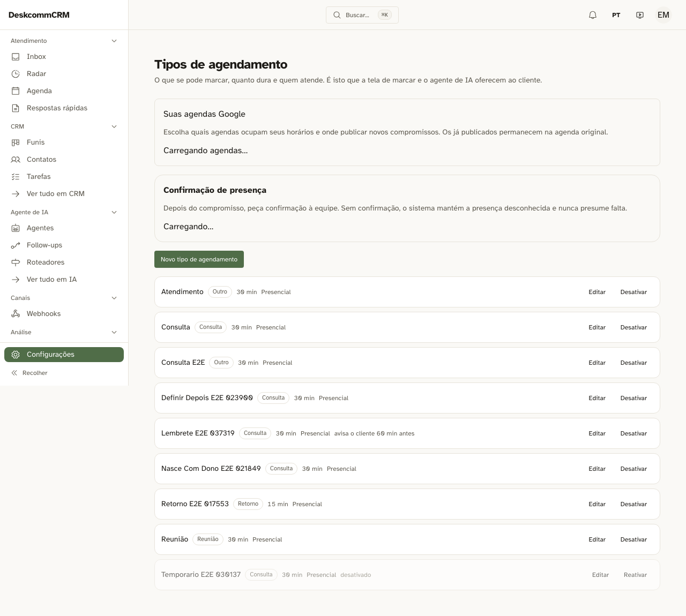

# Prova em tela — ligar o aviso de compromisso

**Régua:** worktree `/Users/rafaelmelgaco/wt/rsky` (exclusivo), branch
`resgate/rafaesky` @ `cb388641`, árvore limpa. Ambiente fresco estilo VPS:
Supabase local do projeto `deskcomm-crm` com a cadeia de migrations movida para
fora e **só o `supabase/baseline.sql`** aplicado (`ON_ERROR_STOP=1`) — o mesmo
que o `install.sh` do kit aplica —, `scripts/seed-e2e-credentials.ts`, app de
**produção** (`pnpm e2e:build` + `next start`) na 3007. Login pelo formulário,
navegação por clique, como um leigo faria.

## O buraco

O cron `agenda-reminder` (`99c33257`) lê `calendar_event_types.reminder_enabled`
e `reminder_minutes_before` desde que nasceu. Nenhum dos dois existia no
`criarSchema`, no `alterarSchema` ou na projeção do GET de
`app/api/v1/agenda/tipos/route.ts`, nem em `app/app/settings/tenant/agenda/`.
Ninguém conseguia ligar o aviso — a varredura devolvia zero linhas em toda
instalação.

## O que a tela mostra agora



Na linha `Lembrete E2E 037319`: **"avisa o cliente 60 min antes"**, ao lado da
duração e do local. Mensagem que sai sozinha para o telefone de um cliente não
pode viver escondida atrás de um clique em "Editar" — e as outras oito linhas da
mesma captura, que não têm o aviso ligado, não exibem nada. O estado aparece
porque é estado, não porque é enfeite.

## O que o caso de Playwright exerce, medido por ferramenta

`tests/e2e/agenda-tipos-de-agendamento.spec.ts` — "ligo o aviso do compromisso
pela tela, e ele fica ligado" (registrado em `SPECS_PARTE_2` do
`.github/workflows/e2e.yml`, junto com os outros quatro casos do arquivo):

```
o tipo NASCE desligado          getByTestId(/^lembrete-ligado-/) → toHaveCount(0)
campo de minutos travado        toBeDisabled()   ← com a caixa desmarcada
marco a caixa                   toBeEnabled()    ← e só então destrava
salvo, a lista conta            "avisa o cliente 60 min antes"
recarrego a página              o texto continua lá  ← não é estado de React
```

Resultado do arquivo inteiro, num run só: **5 passed (44.7s)**.

E a linha do banco, depois do run — porque tela verde não é gravação:

```
$ psql … -c "select name, reminder_enabled, reminder_minutes_before
             from calendar_event_types where name like 'Lembrete E2E%';"
 Lembrete E2E 037319 | t | 60
```

## O que NÃO foi provado em tela

O **envio** em si. Ligar o aviso é o que esta entrega fecha; que a mensagem saia
depende de WAHA de pé, contato com telefone e janela do canal aberta — e é o que
`app/api/v1/cron/agenda-reminder/route.test.ts` cobre sem banco, mais a
`vps-fresh-onboarding` (a P0 que segue fora do CI por dependência externa).
